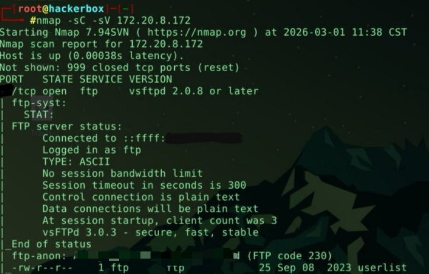
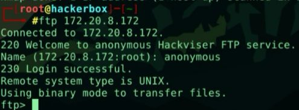
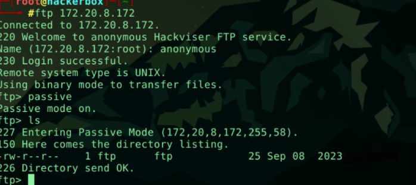
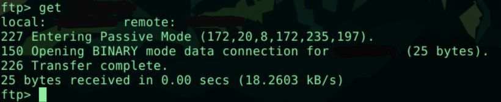

# FTP Anonymous Enumeration — Evidence

This document provides technical evidence of the enumeration process.
Sensitive values and direct answers are intentionally redacted.

---

## Service Discovery

The target system was scanned to identify exposed services.

---

## Service Access

A connection to the discovered service was established successfully.

---

## Directory Enumeration

Accessible resources were enumerated from the service.

---

## Data Retrieval

Publicly accessible data was retrieved from the service.

---

## Local Analysis

Retrieved content was analyzed locally to evaluate exposure.

---

## Note

Sensitive outputs and challenge answers are intentionally censored.
The purpose of this document is to demonstrate methodology validation, not to distribute solutions.
